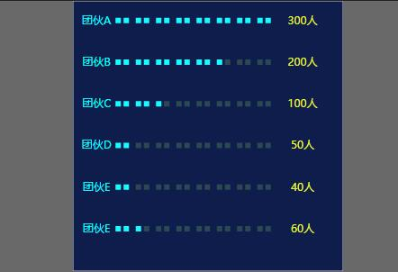

## 刻度条形图

### 使用方式

```
import TickBar from '../components/tickBar'
class TestTickBar extends Component {
  render() {
  	var styles = {
      width: 600,
      height: 600,
      ...
    }

    let data = [
        {

        }
    ]
    return (
    	<div>
    		<TickBar dataset={data} styles={styles} />
    	</div>
    )
  }
}
```

### 效果展示



### 参数说明

使用TickBar组件，需要通过props传入数据，props包括样式和数据两部分，格式分别如下：
####样式数据格式

```
    let styles = {
        width: 400,
        height: 400,
        style: {
            fontFamily: '微软雅黑',
            border: {
                show: true,
                width: 1,
                stroke: '#fff',
                fill: '#0f1d4c'
            },
            text: {
                color: ['#00fefc', '#ebf72b'],
                fontSize: '16px',
                textAlign: 'middle'
            },
            rect: {
                width: 8,
                height: 8,
                color: ['#1afbff', '#2b4953']
            },
            offsetX: 10,
            offsetY: -80,
            inner:40,
            min: 0,
            max: 16,
            scale: 1,
            padding: {
                left: 25,
                right: 30,
                top: 20,
                bottom: 100
            }
        }
    }
```

####数据格式
```
    let data = [
        {
            name: '团伙A',
            value: 300
        },{
            name: '团伙B',
            value: 200
        },{
            name: '团伙C',
            value: 100
        },{
            name: '团伙D',
            value: 50
        },{
            name: '团伙E',
            value: 40
        },{
            name: '团伙E',
            value: 60
        }
    ]
```

### 样式数据参数说明

| 字段                   | 含义       | 是否必选 | 默认值                      | 备注                         |
| :------------------- | -------- | ---- | ------------------------ | -------------------------- |
| width                | svg宽度    | 是    | 无                        |                            |
| height               | svg高度    | 是    | 无                        |                            |
| style                | svg样式    | 是    | 无                        |                            |
| style.fontFamily     | 字体样式     | 否    | 微软雅黑                     |                            |
| style.border         | 边框样式     | 否    | 无                        |                            |
| style.border.show    | 是否显示边框   | 否    | true                     |                            |
| style.border.width   | 边框宽度     | 否    | 1                        |                            |
| style.border.stroke  | 边框颜色     | 否    | #fff                     | 包括color和fontSize属性         |
| style.border.fill    | svg背景色   | 否    | white                    |                            |
| style.text           | 文本样式     | 否    | 无                        |                            |
| style.text.color     | 文本颜色     | 否    | `['#00fefc', '#ebf72b']` | 包括标题和数字两部分                 |
| style.text.fontSize  | 文本字体大小   | 否    | 16px                     |                            |
| style.text.textAlign | 文本位置     | 否    | middle                   | 默认居中                       |
| style.rect           | tick样式   | 否    |                          |                            |
| style.rect.width     | tick宽度   | 否    | 8                        |                            |
| style.rect.height    | tick高度   | 否    | 8                        |                            |
| style.rect.color     | 条形图颜色    | 否    | `['#1afbff', '#2b4953']` | 背景色和正常颜色                   |
| style.offsetX        | 水平偏移距离   | 否    | 10                       |                            |
| style.offsetY        | 垂直偏移距离   | 否    | -80                      |                            |
| style.inner          | tick间隔距离 | 否    | 40                       |                            |
| style.min            | tick最小个数 | 否    | 0                        |                            |
| style.max            | tick最大个数 | 否    | 16                       |                            |
| style.scale          | 缩放因子     | 否    | 1                        |                            |
| style.padding        | 边距距离     | 否    | 无                        | 包括left，right，top和bottom四个值 |