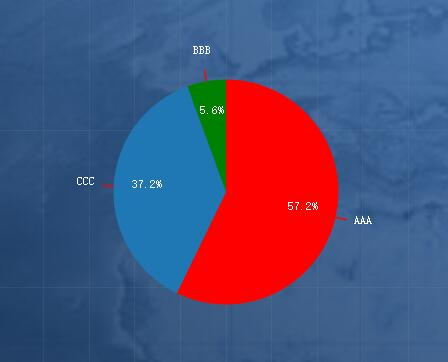
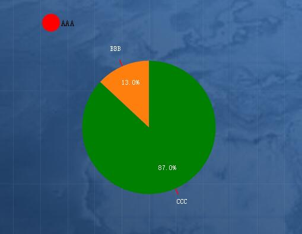

## 饼图

### 使用方式

```
import Pie from '../components/pie'
class TestPie extends Component {
  render() {
  	var pieData = {
      width: 600,
      height: 600,
      ...
    }
    return (
    	<div>
    		<Pie dataset={pieData} />
    	</div>
    )
  }
}
```

### 效果展示

#### 开始效果如下



#### 拖拽后效果如下



### 参数说明

使用Pie组件，需要通过props传入数据，props数据格式如下：

```
var pieData = {
      width: 600,
      height: 600,
      showTips: true,
      showInnerText: true,
      decimalPlaces: 1,
      showOuterText: true,
      dragRedraw: true,
      innerTextStyle: {
        color: 'white',
        fontSize: '15px'
      },
      outerStyle: {
        line: {
          color: 'red',
          width: 2
        },
        text: {
          color: 'white',
          fontSize: '15px'
        }
      },
      tipsClassName: 'hyfe-pie-tooltip',
      innerRadius: 0,
      outerRadius: 150,
      colors: ['red', 'green', 'blue'],
      data: [
            {
                value: 123,
                name: 'AAA'
            },
            {
                value: 12,
                name: 'BBB'
            },
            {
                value: 80,
                name: 'CCC'
            }
        ]
    }
```

### 参数说明

| 字段                       | 含义          | 是否必选 | 默认值                 | 备注                 |
| :----------------------- | ----------- | ---- | ------------------- | ------------------ |
| width                    | svg宽度       | 是    | 无                   |                    |
| height                   | svg高度       | 是    | 无                   |                    |
| showTips                 | 是否显示提示框     | 否    | false               |                    |
| showInnerText            | 饼图上面是否显示占比  | 否    | true                |                    |
| decimalPlaces            | 饼图上占比数据小数位数 | 否    | 1                   |                    |
| showOuterText            | 是否在饼图外显示名称  | 否    | false               |                    |
| dragRedraw               | 饼图是否可拖拽     | 否    | false               | 设置为true，可通过拖拽重计算   |
| innerTextStyle           | 饼图上面内容样式    | 否    | 无                   | 包括color和fontSize属性 |
| innerTextStyle.color     | 饼图上内容颜色     | 否    | white               |                    |
| innerTextStyle.fontSize  | 饼图上内容的大小    | 否    | 12px                |                    |
| outerStyle               | 饼图外面名称样式    | 否    |                     | 包括line和text部分      |
| outerStyle.line          | 饼图连接外部名称的线条 | 否    |                     | 包括color和width属性    |
| outerStyle.line.color    | 饼图连线的颜色     | 否    | black               |                    |
| outerStyle.line.width    | 饼图连线的宽度     | 否    | 1px                 |                    |
| outerStyle.text          | 饼图外名称样式     | 否    |                     | 包括color和fontSize属性 |
| outerStyle.text.color    | 饼图外部名称颜色    | 否    | black               |                    |
| outerStyle.text.fontSize | 饼图外部名称字体大小  | 否    | 12px                |                    |
| tipsClassName            | 提示框样式类名     | 否    | hyfe-pie-tooltip    | 可通过css修改提示框样式      |
| innerRadius              | 内半径大小       | 否    | 0                   | 如果该值大于0，则绘制出来的是环形图 |
| outerRadius              | 外半径大小       | 否    | width/3             | 饼图半径大小             |
| colors                   | 饼图各部分的颜色    | 否    | d3.schemeCategory10 | 默认使用D3中提供的随机颜色     |
| data                     | 绘制饼图所需的数据   | 是    | 无                   | data中每个对象代表饼图的一部分  |
| data.name                | 名称          | 是    | 无                   |                    |
| data.value               | 值           | 是    | 无                   |                    |